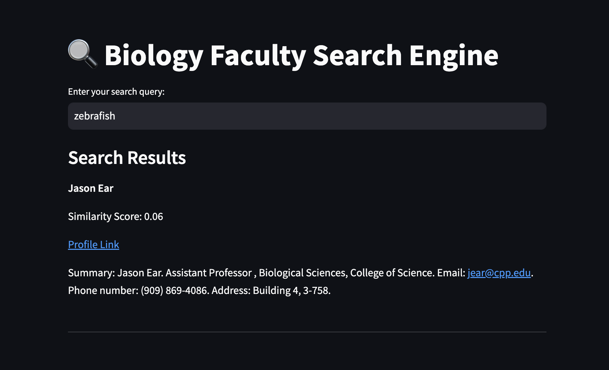

# CPP Biology Faculty Search Engine

## Overview
This project implements a specialized search engine for the Cal Poly Pomona Biology Department's faculty. It crawls faculty web pages, processes the information, and provides a sophisticated search interface to help users find relevant faculty members based on their research interests, expertise, and other attributes.



## 🎥 Demo Video

[](https://www.youtube.com/watch?v=8WPPDGY_8Qw)


## Features
- Web crawling of faculty pages with intelligent target identification
- Structured data extraction of faculty profiles
- Advanced text processing with lemmatization
- TF-IDF based search with cosine similarity ranking
- Spell checking for search queries
- Paginated search results with clickable URLs
- MongoDB-based data persistence

## System Architecture
The system consists of five main components:

1. **Web Crawler** (`Crawler.py`)
   - Crawls the Biology department website
   - Identifies and extracts faculty pages
   - Stores raw HTML content in MongoDB

2. **Faculty Parser** (`facultyParser.py`)
   - Extracts structured information from faculty pages
   - Processes main content and navigation sections
   - Stores parsed data in MongoDB

3. **Text Processor** (`Lemmatizer.py`)
   - Implements text normalization using spaCy
   - Preserves important information like phone numbers
   - Enhances search accuracy through lemmatization

4. **Index Generator** (`IndexAndEmbeddingsGeneration.py`)
   - Creates TF-IDF vectors for faculty documents
   - Builds inverted index for efficient searching
   - Generates and stores document embeddings

5. **Search Engine** (`SearchEngine.py`)
   - Provides interactive search interface
   - Implements spell checking and query processing
   - Ranks results using cosine similarity

## Prerequisites
- Python 3.x
- MongoDB
- Required Python packages:
  ```
  beautifulsoup4
  pymongo
  regex
  pyspellchecker
  spacy
  scikit-learn
  numpy
  streamlit
  ```
- spaCy's English language model:
  ```
  python -m spacy download en_core_web_lg
  ```

## Installation

1. Clone the repository:
   ```bash
   git clone https://github.com/ShivamPatel-India/Bio_Department_SearchEngine.git
   cd CS5180-finalproject
   ```

2. Install required packages:
   ```bash
   pip install beautifulsoup4 pymongo regex pyspellchecker spacy scikit-learn numpy streamlit
   ```

3. Download spaCy's English language model:
   ```bash
   python -m spacy download en_core_web_lg
   ```

4. Ensure MongoDB is running locally on the default port (27017)

## Usage

Run the components in the following order:

1. Start the web crawler:
   ```bash
   python Crawler.py
   ```

2. Parse faculty information:
   ```bash
   python facultyParser.py
   ```

3. Process text with lemmatization:
   ```bash
   python Lemmatizer.py
   ```

4. Generate search indices - this will generate a pickle file as well:
   ```bash
   python IndexAndEmbeddingsGeneration.py
   ```

5. Start the search engine WebUI or ConsoleUI:
   ```bash
   streamlit run SearchUI.py
   ```
   OR

   ```bash
   python SearchEngine.py
   ```

## Data Storage
The system uses MongoDB with the following collections:
- `CrawledPages`: Raw HTML content
- `FacultyInfo`: Structured faculty data
- `InvertedIndex`: Search index data
- `Embeddings`: TF-IDF vectors
